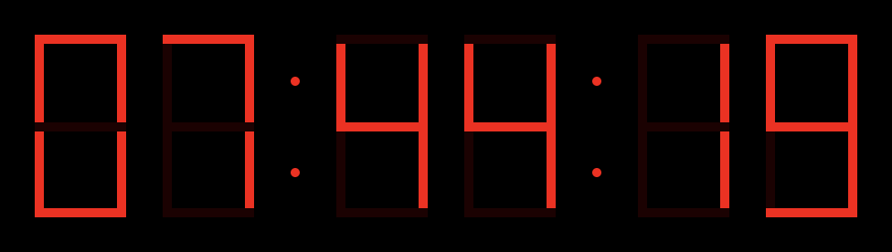

## Prompt

A seven-segment display is a form of electronic display device for displaying decimal numerals. Seven-segment displays are widely used in digital clocks.

Make a digital clock that represents current time in a UI similar to this image.

## Solution

[Seven Segment Clock](embedded-codesandbox://seven-segment-clock)

## Clarifying Questions

- 12-hour or 24-hour clock? 24-hour. (If candidate wants to be a 12-hour clock, they can too)
- Should I show seconds too? Not required.
- Can I use HTML/SVG/Canvas/Flexbox/WebGL etc? Any frontend rendering technology is game.
- How should I handle single-digit numbers (like the "1" in "1:00")? The tens digit should be a zero: "01:00"
- Do I need to render the colon in between the hours and the seconds? Not required.
- How accurate should the clock be? Accurate to within +/- 1 second of system clock, meaning the solution should update at least every second.

## Evaluation Criteria

- Using a map of on/off states for each number
- Recognizing the digit component and re-using it instead of repeating code
- Using Date object properly
- Clearing up the interval once component is deleted
