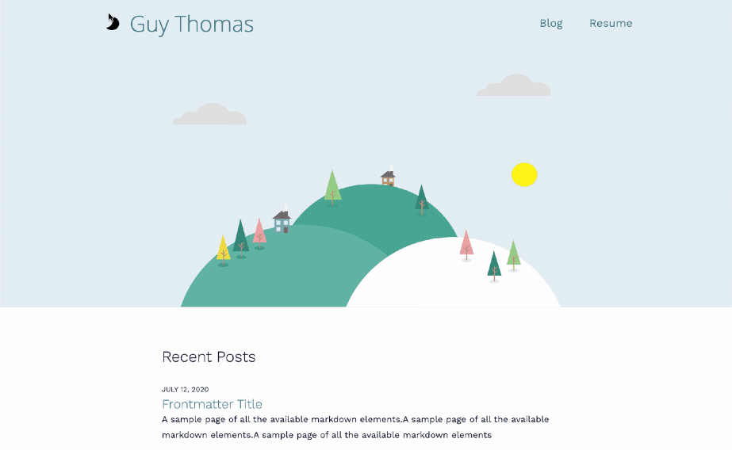

# [guythomas.me](https://guythomas.me/)

A pre-configured blog and resume featuring dark mode

## Blog / Landing Page

## Resume

A resume that can be configured with a simple `YAML` file. A PDF version is downloadable ( which is conveniently the same output as printing the page with no boarders on A4 ).

## Stack

- FE Framework - [React](https://reactjs.org/)
- CSS in JS - [Emotion](https://emotion.sh/docs/introduction)
- Site Generation - [Gatsby](https://www.gatsbyjs.org/)
- Hosting/CI - [Netlify](https://www.netlify.com/)

## Getting started

1. Clone this repo and enter the directory `git clone https://github.com/guyathomas/guythomas.me.git && cd guythomas.me/`
2. Install deps with `npm i`
3. Run development server with `npm run develop`
4. Navigate to `localhost:8000` in your browser

## Site Plan

- Home - Recent posts
  - Blog - Summary of all posts
  - Resume - A printable resume

## TODO:

- [ ] Migrate to Remix.run + TailwindCSS

### Arch

- Enable better SSR for desktop width applications
